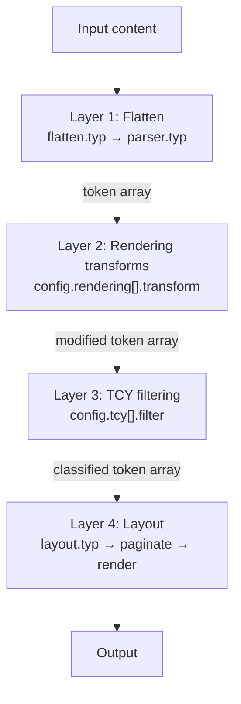
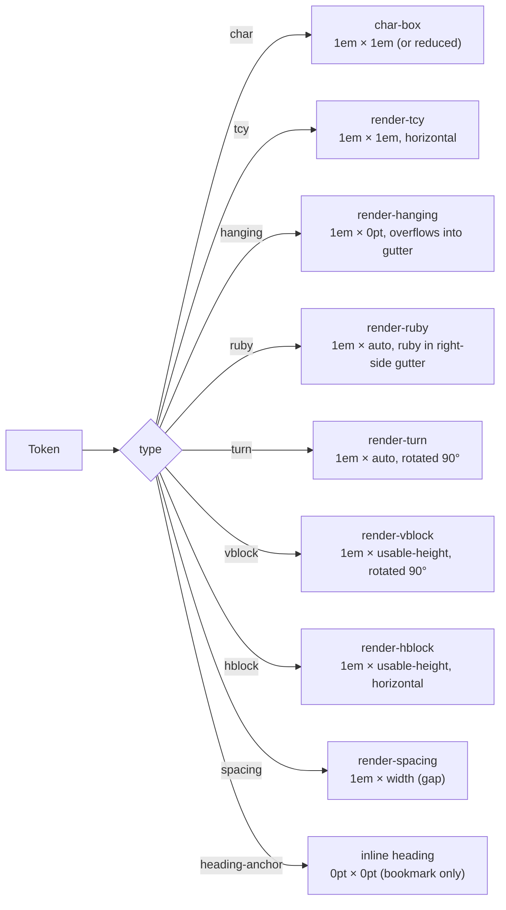

# Architecture

Basho is built on a **Dependency Injection** architecture. Every component is pluggable via a single `config` dictionary. The rendering pipeline has four layers:



## Layer 1 — Flatten (`src/pipeline/flatten.typ` + `src/core/parser.typ`)

Walks the Typst content tree recursively. Native elements (`text`, `strong`, `emph`, `heading`, `list`, `enum`, `equation`, metadata macros) are converted into flat token dictionaries:

```typst
(type: "char", text: "あ", bold: false, italic: false)
(type: "tcy", text: "ABC")
(type: "ruby", text: "漢字", ruby: "かんじ")
(type: "turn", text: content)
(type: "newline", text: "\n")
(type: "spacing", width: 0.25em)
(type: "hanging", text: "。")
```

Consecutive Latin/digit runs are automatically grouped into TCY tokens.

## Layer 2 — Rendering transforms (`config.rendering[].transform`)

Each module in `config.rendering` can export a `transform(tokens) => tokens` function. These are applied in order:

| Module | Purpose |
|---|---|
| `default-rendering-params()` | Normalizes dashes (EM DASH → HORIZONTAL BAR) |
| `default-spacing()` | Inserts gaps between CJK and European text |
| `default-turn` | (no transform — provides node renderer) |
| `default-vblock` | (no transform — provides node renderer) |
| `default-hblock` | (no transform — provides node renderer) |
| `default-bullet-list-params()` | (registered dynamically — provides node renderer) |
| `default-numbered-list-params()` | (registered dynamically — provides node renderer) |

## Layer 3 — TCY filtering (`config.tcy[].filter`)

Each TCY module exports a `filter(tokens, config) => tokens` function. The default module classifies auto-detected TCY runs into:

- **"horizontal"** — kept as TCY (e.g. short numbers like `42`)
- **"rotated"** — converted to `turn` tokens (e.g. `ABC`)
- **"char"** — split into individual upright `char` tokens

## Layer 4 — Layout & Rendering (`src/layout.typ` → `src/renderer/renderer.typ`)

### Measurement

Every token is measured inside the layout context using `measure(render-char-token(...))`, producing an array of absolute heights.

### Pagination (`paginate`)

Iterates through tokens, accumulates height. When adding a token would exceed the column height, it calls `config.kinsoku.resolve(...)` to determine the line-breaking action.

See [kinsoku.md](kinsoku.md) for the resolution rules.

### Node-renderer dispatch (`renderer.typ`)

Each token type is dispatched to a dedicated renderer:



Custom node renderers can be injected via any module's `node-renderers` field.

### Column assembly

Columns are arranged right-to-left (RTL) in segments, with multi-page overflow via `colbreak()`.

## Source tree

```
src/
├── main.typ              # Public API entry: tate(), tate-inline(), inline macros
├── config.typ            # merge-config, default-opts, factory functions
├── layout.typ            # paginate, render-column, render-page, layout-tate
├── pipeline/
│   └── flatten.typ       # Content tree traversal → token array
├── core/
│   ├── parser.typ        # String tokenizer (inline parsing)
│   ├── char-box.typ      # Character box rendering
│   ├── kinsoku.typ       # Japanese line-breaking rules + default resolver
│   ├── tcy.typ           # Tate-chu-yoko detection & classification
│   ├── spacing.typ       # CJK/European spacing insertion
│   ├── turn.typ          # Rotated content rendering
│   ├── vblock.typ        # Vertical block rendering
│   ├── hblock.typ        # Horizontal block rendering
│   └── list.typ          # Bullet & numbered list modules
└── renderer/
    ├── renderer.typ      # Token dispatch → individual renderers
    └── ruby.typ          # Ruby (furigana) rendering
```
