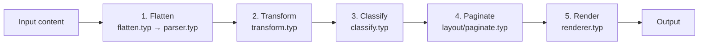
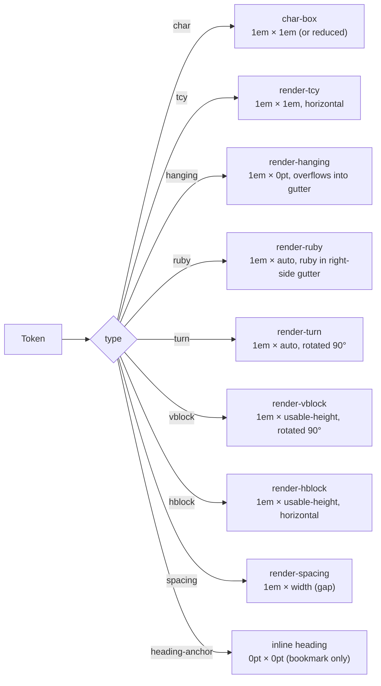

# Architecture

Basho is built on a **Dependency Injection** architecture. Every component is pluggable via a single `config` dictionary. The rendering pipeline has five stages:



## Stage 1 — Flatten (`src/pipeline/flatten.typ` + `src/pipeline/parser.typ`)

Walks the Typst content tree recursively. Native elements (`text`, `strong`, `emph`, `heading`, `list`, `enum`, `equation`, metadata macros) are converted into flat token dictionaries:

```typst
(type: "char", text: "あ", bold: false, italic: false)
(type: "tcy", text: "ABC")
(type: "ruby", text: "漢字", ruby: "かんじ")
(type: "turn", text: content)
(type: "newline", text: "\n")
(type: "spacing", width: 0.25em)
(type: "hanging", text: "。")
```

Consecutive Latin/digit runs are automatically grouped into TCY tokens.

## Stage 2 — Transform (`src/pipeline/transform.typ`)

Applies every rendering module's `transform(tokens) => tokens` function in config.rendering order. This stage is responsible for token mutation and cleanup before classification:

```typst
(module.transform)(tokens)  // called for each module that has a "transform" key
```

Each module in `config.rendering` can export a `transform(tokens) => tokens` function. These are applied in order:

| Module | Purpose |
|---|---|
| `default-rendering-params()` | Normalizes dashes (EM DASH → HORIZONTAL BAR) |
| `default-spacing()` | Inserts gaps between CJK and European text |
| `default-turn` | (no transform — provides node renderer) |
| `default-vblock` | (no transform — provides node renderer) |
| `default-hblock` | (no transform — provides node renderer) |
| `default-bullet-list-params()` | (registered dynamically — provides node renderer) |
| `default-numbered-list-params()` | (registered dynamically — provides node renderer) |

## Stage 3 — Classify (`src/pipeline/classify.typ`)

Applies every TCY module's `filter(tokens, config) => tokens` function in config.tcy order. The default module classifies auto-detected TCY runs into:

- **"horizontal"** — kept as TCY (e.g. short numbers like `42`)
- **"rotated"** — converted to `turn` tokens (e.g. `ABC`)
- **"char"** — split into individual upright `char` tokens

## Stage 4 — Paginate (`src/layout/paginate.typ`)

Every token is measured inside the layout context using `measure(render-char-token(...))`, producing an array of absolute heights.

### Pagination algorithm

Iterates through tokens, accumulates height. When adding a token would exceed the column height, it calls `config.kinsoku.resolve(...)` to determine the line-breaking action.

See [kinsoku.md](kinsoku.md) for the resolution rules.

## Stage 5 — Render (`src/renderer/renderer.typ`)

### Node-renderer dispatch

Each token type is dispatched to a dedicated renderer:



Custom node renderers can be injected via any module's `node-renderers` field.

See [token-schema.md](token-schema.md) for all token types and their required fields.
See [modules.md](modules.md) for module contract specifications.
See [extending.md](extending.md) for custom module examples.

### Column assembly

Columns are arranged right-to-left (RTL) in segments, with multi-page overflow via `colbreak()`.

## Source tree

```
src/
├── main.typ              # Public API entry: tate(), tate-inline(), inline macros
├── config.typ            # merge-config, default-opts, factory functions
├── components/           # Element renderers and component modules
│   ├── char-box.typ      # Character box rendering
│   ├── hblock.typ        # Horizontal block rendering
│   ├── list.typ          # Bullet & numbered list modules
│   ├── tcy.typ           # Tate-chu-yoko logic
│   ├── turn.typ          # Rotated content rendering
│   └── vblock.typ        # Vertical block rendering
├── kinsoku/              # Japanese line-breaking rules
│   ├── kinsoku-builtin.typ # Default priority-based resolver
│   ├── kinsoku-utils.typ # Shared line-breaking utilities
│   ├── kinsoku.typ       # Main kinsoku entry point
│   └── spacing.typ       # CJK/European spacing insertion
├── layout/               # Pagination and assembly
│   ├── layout.typ        # Main vertical layout entry point
│   ├── page.typ          # Page and column rendering
│   └── paginate.typ      # Core pagination algorithm
├── pipeline/             # Core AST operations
│   ├── classify.typ      # Classify stage: apply config.tcy filters
│   ├── flatten.typ       # Content tree traversal → token array
│   ├── parser.typ        # String tokenizer (inline parsing)
│   ├── token.typ         # Token creation and merge helpers
│   └── transform.typ     # Transform stage: apply config.rendering transforms
├── renderer/             # Token rendering
│   ├── renderer.typ      # Token dispatch → individual renderers
│   └── ruby.typ          # Ruby (furigana) rendering
└── utils/                # Generic helpers
    └── validate.typ      # Config validation
```
