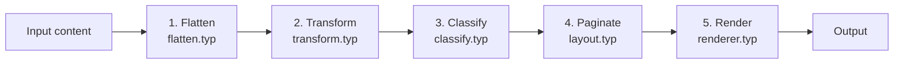

# Extending Basho

Basho is designed to be extended through configuration rather than forking. This guide shows how to replace or customize every major subsystem.

## Architecture overview

The rendering pipeline runs in five ordered stages:



1. **Flatten** — walks the Typst content tree, producing a flat token array
2. **Transform** — applies `config.rendering[].transform` functions in order
3. **Classify** — applies `config.tcy[].filter` functions in order
4. **Paginate** — splits tokens into columns based on height and kinsoku rules
5. **Render** — dispatches each token to its type-specific renderer

You can inject custom behavior at any stage.

---

## Custom TCY classifier

Replace how short Latin/digit runs are categorized:

```typst
#let my-tcy() = (
  pattern: regex("^[A-Za-z0-9,.!?:;]+$"),
  sizes: (1em, 0.65em, 0.5em),
  filter: (tokens, config) => {
    tokens.map(t => {
      if t.type != "tcy" { return t }
      // Always render 3+ letter runs as rotated
      if t.text.len() >= 3 { return t + (type: "turn", text: t.text) }
      t  // keep short runs as TCY
    })
  },
)

#tate(config: (tcy: (my-tcy(),)))[...]
```

---

## Custom kinsoku resolver

Override line-breaking decisions entirely:

```typst
#let my-resolver = (
  resolve: (col, token, h, config, cur-h, max-h) => {
    // Never break before a comma
    if token.type == "char" and token.text == "，" {
      return (action: "push-previous")
    }
    // Always break before periods
    if token.type == "char" and token.text == "。" {
      return (action: "oidashi")
    }
    // Default behavior for everything else
    return (action: "oidashi")
  },
)

#tate(config: (kinsoku: my-resolver))[...]
```

See [kinsoku.md](kinsoku.md) for the built-in resolver parameters and helper functions.

---

## Custom list modules

Replace list formatting completely:

```typst
#let compact-bullets() = (
  marker: "•",
  flatten: (c, _flatten, config) => {
    let tokens = ()
    for child in c.children {
      tokens.push(token("bullet-list-marker"))
      // No newline between items — compact style
      tokens += _flatten(child.body, config)
    }
    tokens
  },
  node-renderers: (
    "bullet-list-marker": (token, config) => {
      box(
        width: config.sizing.char-box,
        height: config.sizing.char-box * 0.5,
        align(center + horizon,
          text(features: config.features, "▪"),
        ),
      )
    },
  ),
)

#tate(config: (
  list: (bullet: compact-bullets()),
))[...]
```

---

## Custom rendering transforms

Insert or modify tokens between flattening and classification:

```typst
#let my-transform = (
  transform: tokens => {
    let result = ()
    for t in tokens {
      // Double every "。" character
      if t.type == "char" and t.text == "。" {
        result.push(t)
        result.push(t)
      } else {
        result.push(t)
      }
    }
    result
  },
)

#tate(config: (
  rendering: (
    default-rendering-params(),
    my-transform,
    default-spacing(),
    default-turn,
    default-vblock,
    default-hblock,
  ),
))[...]
```

---

## Custom node renderers

Add a new token type with its own renderer:

```typst
#tate(config: (
  rendering: (
    default-rendering-params(),
    default-spacing(),
    default-turn,
    default-vblock,
    default-hblock,
    (node-renderers: (
      "star": (token, config) => {
        text(size: config.sizing.char-box, "★")
      },
    )),
  ),
))[
  // Then in your document, inject a "star" token:
  #metadata((type: "star"))
]
```

---

## Config validation

When you supply invalid configuration, Basho will panic with a descriptive message. For example:

```
error: basho: config.tcy must be an array of TCY modules
```

This catches missing keys, wrong types, and missing function shapes early. All validation runs at the top of `#tate()` and `#tate-inline()`, before any processing begins.

---

## Preserving defaults

If you only want to override one aspect, import and compose with the default factories:

```typst
#import "@preview/basho:0.1.0": tate, default-rendering-params, default-spacing

#tate(config: (
  rendering: (
    default-rendering-params(dash-scale: 1.5em),
    default-spacing(cjk-european-gap: 0.15em),
  ),
))[...]
```

Arrays (like `rendering`, `tcy`) are replaced wholesale — they are **not** deep-merged. So you must include all modules you want, including the defaults.
