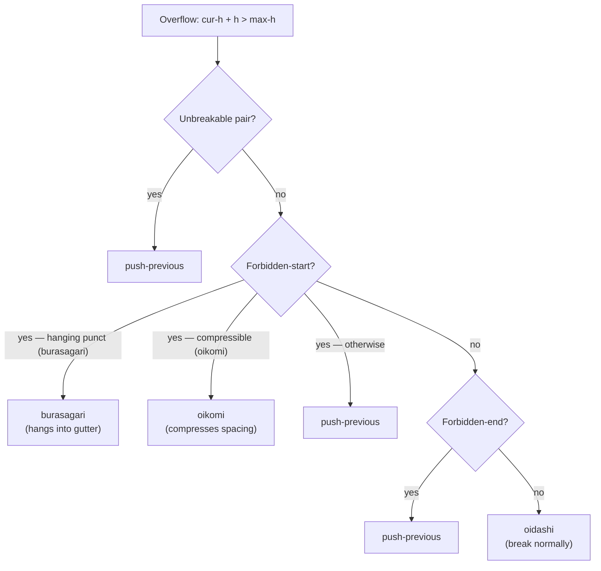

# Kinsoku Shori (禁則処理)

Kinsoku shori controls how lines break at column boundaries — the Japanese typesetting rules that prevent orphaned punctuation, unsplittable character pairs, and other typographic violations.

The default resolver implements four priority tiers matching the JIS X 4051 standard:

## Priority tiers



| Priority | Rule | Action |
|---|---|---|
| 0 | Unsplittable pairs (`——` `……`) | `push-previous` |
| 1 | Forbidden-start (Gyoto) — hanging | `burasagari` |
| 2 | Forbidden-start — compression (Oikomi) | `oikomi` |
| 3 | Forbidden-start — cascade | `push-previous` |
| — | Forbidden-end (Gyomatsu) | `push-previous` |
| — | Default | `oidashi` |

## Default resolver factory

```typst
#import "@preview/basho:0.1.0": tate, default-resolver

// Defaults (burasagari mode)
config: (kinsoku: default-resolver())

// Oikomi mode (compression instead of hanging)
config: (kinsoku: default-resolver(mode: "oikomi"))

// Custom character sets
config: (kinsoku: default-resolver(
  hanging: "、。，．！？",
  forbidden-start: "）〕］｝",
))
```

### Parameters

| Parameter | Default | Description |
|---|---|---|
| `forbidden-start` | `）〕］｝〉》」』】)]}〞\u{201d}\u{2019}。、，．・：；ー～ぁぃぅぇぉっゃゅょゎァィゥェォッャュョヮヵヶ！？` | Characters that must not start a column |
| `forbidden-end` | `（〔［｛〈《「『【([{〝\u{201c}\u{2018}` | Characters that must not end a column |
| `hanging` | `、。，．` | Characters that can hang into the gutter |
| `unbreakable-chars` | `—―…‥` | Consecutive pairs of these chars are unsplittable |
| `compressible-punctuation` | `、。，．` | Characters eligible for Oikomi compression |
| `mode` | `"burasagari"` | `"burasagari"` (hang) or `"oikomi"` (compress) |
| `compression-per-punct` | `0.5` | Max compression per punct (× char-box size) |
| `consecutive-compression` | `0.25` | Additional compression for consecutive punct pairs |
| `max-stretch` | `1.0` | Max extra space added per justification point (× char-box size) |
| `resolve-fn` | `none` | Custom resolve function override |

## Custom resolve functions

The resolve signature is:

```typst
(col, next-token, next-height, config, cur-height, max-height) => (
  action: "burasagari" | "oikomi" | "push-previous" | "oidashi",
  compression-amount: length,  // only for oikomi
)
```

Standalone helpers are exported from `src/core/kinsoku.typ` for building custom resolvers:

```typst
#import "src/core/kinsoku.typ":
  is-forbidden-start, is-forbidden-end, is-hanging,
  is-unbreakable-pair, is-compressible-punctuation,
  calculate-shrinkable-space, apply-spacing-compression,
  get-compressible-amount, count-justification-points, justify-line,
  is-valid-line-end, default-resolver
```

### Full replacement example

```typst
config: (kinsoku: (
  resolve: (col, token, h, config, cur-h, max-h) => {
    if token.type == "char" and token.text == "。" {
      return (action: "oidashi")
    }
    return (action: "push-previous")
  },
))
```
