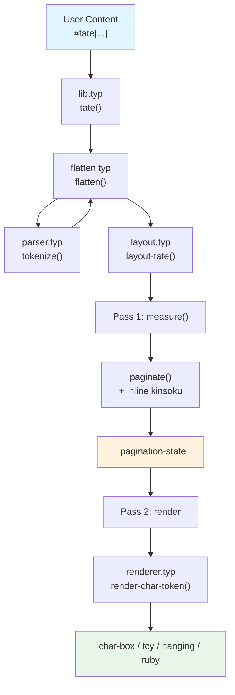
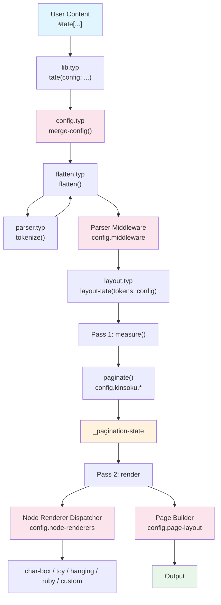

# Phase 2 — Dependency Injection Architecture Refactor

Refactor the basho vertical typesetting engine from hardcoded logic into a fully configurable, plugin-friendly architecture via dependency injection.

---

## Open Questions

> [!IMPORTANT]
> ### Q1: Config Scope — Global vs Per-Call
> Should the config be a **global show rule** (applied once, affects all `tate()` calls) or a **per-call parameter** (each `tate()` can receive its own config)?
>
> **Option A — Global (show rule / `set` style):**
> ```typst
> #show: basho.configure.with(kinsoku: (mode: "burasagari"))
> #tate[...]  // all tate calls inherit global config
> ```
>
> **Option B — Per-call parameter:**
> ```typst
> #tate(config: (kinsoku: (mode: "oikomi")))[...]
> ```
>
> **Option C — Both** (global default + per-call override). This is the most flexible but adds complexity.

> [!IMPORTANT]
> ### Q2: Kinsoku Modes
> Currently we have 3 behaviors hardcoded: **burasagari** (hanging punctuation), **oidashi** (push-out for closing chars), and **opening bracket push**. Your spec mentions `config.kinsoku.mode` to switch between `oikomi` (push-in) and `burasagari` (hang).
>
> - Should `mode` be a global toggle that changes behavior for **all** closing/punctuation characters?
> - Or should each character category (`forbidden-start`, `forbidden-end`, `hanging`) be independently configurable while `mode` only affects the column-overflow strategy?
> - Do you want to support a third mode like `tsumekumi` (compression) where characters are squeezed rather than moved?

> [!IMPORTANT]
> ### Q3: Parser Middleware — Execution Context
> Middleware functions receive the token array and return a modified array. Do they also need access to:
> - The original raw content (before tokenization)?
> - The current config dictionary?
> - The font name (for measurement purposes)?
>
> This affects the middleware function signature: `(tokens) => tokens` vs `(tokens, config) => tokens`.

> [!WARNING]
> ### Q4: Node Renderer Signature
> Custom node renderers injected via `config.node-renderers` need to produce content. What should the function signature be?
>
> **Option A — Simple:** `(token, font) => content` (matches current `render-char-token`)
>
> **Option B — Config-aware:** `(token, font, config) => content` (renderer can read sizing/feature config)
>
> Option B is more powerful but couples renderers to the config schema.

> [!NOTE]
> ### Q5: Breaking Change Policy
> The current public API is `tate(body, font, columns, column-gap)` plus `tcy()` and `ruby()`. The DI refactor will add a `config` parameter. Should we:
> - Keep full backward compatibility (old code works unchanged)?
> - Allow minor signature changes if documented?

---

## Current Architecture Audit

### Hardcoded Decisions to Extract

Based on a full codebase audit, here are **all hardcoded values** that will move into the config dictionary:

#### Font & OpenType Features (4 locations)
| Value | File(s) | Occurrences |
|---|---|---|
| `"Harano Aji Mincho"` | [lib.typ](file:///Users/rk/Documents/apps/typeset/basho/lib.typ#L27) | 1 (already a param) |
| `("vert", "vrt2")` | [char-box.typ](file:///Users/rk/Documents/apps/typeset/basho/src/char-box.typ#L21), [renderer.typ](file:///Users/rk/Documents/apps/typeset/basho/src/renderer.typ#L46), [ruby.typ](file:///Users/rk/Documents/apps/typeset/basho/src/ruby.typ#L44) | 4 |

#### Sizing Constants (11 locations)
| Value | Purpose | File |
|---|---|---|
| `1em × 1em` | Character box size | [char-box.typ](file:///Users/rk/Documents/apps/typeset/basho/src/char-box.typ#L15-L16) |
| `0.5em / 0.4em / 0.35em` | TCY font size breakpoints | [renderer.typ](file:///Users/rk/Documents/apps/typeset/basho/src/renderer.typ#L19-L21) |
| `1.5 / 1.3 / 1.15` | Heading scale factors (h1/h2/h3) | [renderer.typ](file:///Users/rk/Documents/apps/typeset/basho/src/renderer.typ#L63-L65) |
| `0.5em` | Ruby character size | [ruby.typ](file:///Users/rk/Documents/apps/typeset/basho/src/ruby.typ#L30) |
| `1em` | Ruby gutter offset (dx) | [ruby.typ](file:///Users/rk/Documents/apps/typeset/basho/src/ruby.typ#L64) |
| `1em` gap, `2em` column-gap | Default spacing | [layout.typ](file:///Users/rk/Documents/apps/typeset/basho/src/layout.typ#L145) |

#### Kinsoku Character Sets (3 regexes)
| Set | Characters | File |
|---|---|---|
| `_opening-re` | 16 opening bracket/quote chars | [kinsoku.typ](file:///Users/rk/Documents/apps/typeset/basho/src/kinsoku.typ#L13) |
| `_closing-re` | 38 closing/small-kana/chōon chars | [kinsoku.typ](file:///Users/rk/Documents/apps/typeset/basho/src/kinsoku.typ#L17) |
| `_hanging-re` | 4 comma/period chars | [kinsoku.typ](file:///Users/rk/Documents/apps/typeset/basho/src/kinsoku.typ#L30) |

#### Parser Decisions
| Value | Purpose | File |
|---|---|---|
| `regex("^[A-Za-z0-9]+$")` | TCY character detection | [parser.typ](file:///Users/rk/Documents/apps/typeset/basho/src/parser.typ#L14) |

#### Layout Directions
| Value | Purpose | File |
|---|---|---|
| `ttb` | Column flow (top-to-bottom) | [layout.typ](file:///Users/rk/Documents/apps/typeset/basho/src/layout.typ#L21) |
| `rtl` | Column order (right-to-left) | [layout.typ](file:///Users/rk/Documents/apps/typeset/basho/src/layout.typ#L129) |
| `right + top` | Page alignment | [layout.typ](file:///Users/rk/Documents/apps/typeset/basho/src/layout.typ#L126) |

### Current Data Flow



### Target Data Flow (After DI)



---

## Proposed Changes

### Step 1 — Config System (`config.typ`)

#### [NEW] [config.typ](file:///Users/rk/Documents/apps/typeset/basho/src/config.typ)

Create the default options dictionary and a recursive deep-merge function.

```typst
#let default-opts = (
  font: "Harano Aji Mincho",
  features: ("vert", "vrt2"),

  sizing: (
    char-box: 1em,
    ruby-size: 0.5em,
    ruby-offset: 1em,
    tcy-sizes: (0.5em, 0.4em, 0.35em),  // for len <=2, ==3, >=4
    heading-scales: (1.5, 1.3, 1.15),    // h1, h2, h3
    gap: 1em,
    column-gap: 2em,
  ),

  kinsoku: (
    mode: "burasagari",  // or "oikomi"
    forbidden-start: "）〕］｝〉》」』】)]}〞\u{201d}\u{2019}。、，．・：；ー～ぁぃぅぇぉっゃゅょゎァィゥェォッャュョヮヵヶ！？",
    forbidden-end: "（〔［｛〈《「『【([{〝\u{201c}\u{2018}",
    hanging: "、。，．",
  ),

  tcy-pattern: regex("^[A-Za-z0-9]+$"),

  node-renderers: (:),       // type-name → (token, font, config) => content
  page-layout: none,         // (columns-array, font, gap, config) => content
  middleware: (),             // array of (tokens, config) => tokens
)
```

The `merge-config` function handles nested dictionary merging so users only override what they need:

```typst
#let merge-config(base, user) = {
  let result = base
  for (key, val) in user {
    if key in result and type(result.at(key)) == dictionary and type(val) == dictionary {
      result.insert(key, merge-config(result.at(key), val))
    } else {
      result.insert(key, val)
    }
  }
  result
}
```

---

### Step 2 — Page Builder Injection (Dangumi Hook)

#### [MODIFY] [layout.typ](file:///Users/rk/Documents/apps/typeset/basho/src/layout.typ)

- Change `layout-tate` to accept `config` dict instead of individual params (`font`, `gap`, `columns`, `column-gap`).
- In **Pass 2** (column assembly), replace the hardcoded `stack(dir: rtl, ...)` + `stack(dir: ttb, ...)` logic with a call to `config.page-layout` if provided, otherwise use the current default logic.
- The page-layout hook signature: `(page-cols, font, gap, config) => content`

```diff
-#let render-page(cols, font, gap) = {
+#let render-page(cols, font, gap, config) = {
+  if config.page-layout != none {
+    return (config.page-layout)(cols, font, gap, config)
+  }
   let rendered = cols.map(col => render-column(col, font))
   align(right + top,
     stack(dir: rtl, spacing: gap, ..rendered)
   )
 }
```

---

### Step 3 — Node Renderer Dispatcher

#### [MODIFY] [renderer.typ](file:///Users/rk/Documents/apps/typeset/basho/src/renderer.typ)

- Change `render-char-token(token, font)` → `render-char-token(token, font, config)`.
- Before the existing `if token.type == "char"` chain, check `config.node-renderers` for a key matching `token.type`. If found, call it.
- Extract all hardcoded sizing (heading scales, TCY sizes, ruby offset) from literals to `config.sizing.*`.
- Extract OpenType features from `("vert", "vrt2")` literals to `config.features`.

```diff
 #let render-char-token(token, font, config) = {
+  // Check injected renderers first
+  if token.type in config.node-renderers {
+    return (config.node-renderers.at(token.type))(token, font, config)
+  }
+
   // ... existing dispatch with config.sizing.* lookups ...
 }
```

#### [MODIFY] [char-box.typ](file:///Users/rk/Documents/apps/typeset/basho/src/char-box.typ)
- Add `config` parameter to `char-box(body, font, config, h-align: center)`.
- Replace hardcoded `1em` with `config.sizing.char-box`.
- Replace hardcoded `("vert", "vrt2")` with `config.features`.

#### [MODIFY] [ruby.typ](file:///Users/rk/Documents/apps/typeset/basho/src/ruby.typ)
- Add `config` parameter to `render-ruby(token, font, config)`.
- Replace hardcoded `0.5em` with `config.sizing.ruby-size`.
- Replace hardcoded `dx: 1em` with `config.sizing.ruby-offset`.
- Replace hardcoded `("vert", "vrt2")` with `config.features`.

---

### Step 4 — Decouple Kinsoku Shori

#### [MODIFY] [kinsoku.typ](file:///Users/rk/Documents/apps/typeset/basho/src/kinsoku.typ)

- Remove the 3 hardcoded regex constants (`_opening-re`, `_closing-re`, `_hanging-re`).
- Change `is-opening`, `is-closing`, `is-hanging` to accept `config` and look up character sets from `config.kinsoku.forbidden-end`, `config.kinsoku.forbidden-start`, `config.kinsoku.hanging`.
- Since these are called per-token inside hot pagination loops, use string `.contains()` on the character set strings rather than regex for performance.

```diff
-#let _closing-re = regex("^[...]$")
-#let is-closing(token) = {
-  if token.type != "char" { return false }
-  token.text.match(_closing-re) != none
-}
+#let is-closing(token, config) = {
+  if token.type != "char" { return false }
+  config.kinsoku.forbidden-start.contains(token.text)
+}
```

#### [MODIFY] [layout.typ](file:///Users/rk/Documents/apps/typeset/basho/src/layout.typ) — `paginate()`

- Pass `config` to all `is-hanging()`, `is-closing()`, `is-opening()` calls.
- Read `config.kinsoku.mode` to determine behavior:
  - `"burasagari"`: Current behavior — hanging punctuation overflows, closing chars trigger oidashi.
  - `"oikomi"`: All forbidden-start chars get pulled into current column (pushed in) rather than triggering oidashi.

---

### Step 5 — Parser Middleware Pipeline

#### [MODIFY] [lib.typ](file:///Users/rk/Documents/apps/typeset/basho/lib.typ)

After `flatten(body)` produces the token array, iterate through `config.middleware` and apply each function sequentially:

```diff
 #let tate(body, config: (:)) = {
+  let cfg = merge-config(default-opts, config)
-  layout-tate(flatten(body), font, ...)
+  let tokens = flatten(body, cfg)
+  for mw in cfg.middleware {
+    tokens = mw(tokens, cfg)
+  }
+  layout-tate(tokens, cfg)
 }
```

#### [MODIFY] [flatten.typ](file:///Users/rk/Documents/apps/typeset/basho/src/flatten.typ)
- Pass `config` through to `tokenize()`.

#### [MODIFY] [parser.typ](file:///Users/rk/Documents/apps/typeset/basho/src/parser.typ)
- Replace hardcoded `regex("^[A-Za-z0-9]+$")` with `config.tcy-pattern`.

---

### Step 6 — Update Public API

#### [MODIFY] [lib.typ](file:///Users/rk/Documents/apps/typeset/basho/lib.typ)

```typst
#import "src/config.typ": default-opts, merge-config

#let tcy(body) = metadata((type: "tcy", text: body))
#let ruby(base, rt) = metadata((type: "ruby", text: base, ruby: rt))

#let tate(body, font: none, columns: none, column-gap: none, config: (:)) = {
  // Merge user config with defaults
  let cfg = merge-config(default-opts, config)
  // Legacy params override config for backward compatibility
  if font != none { cfg.font = font }
  if columns != none { cfg.insert("columns", columns) }
  if column-gap != none { cfg.sizing.column-gap = column-gap }

  let tokens = flatten(body, cfg)
  for mw in cfg.middleware {
    tokens = mw(tokens, cfg)
  }
  layout-tate(tokens, cfg)
}
```

---

## Files Changed Summary

| Action | File | What Changes |
|---|---|---|
| **[NEW]** | `src/config.typ` | `default-opts`, `merge-config()` |
| **[MODIFY]** | `lib.typ` | Accept `config:` param, apply middleware, merge with legacy params |
| **[MODIFY]** | `src/layout.typ` | Accept `config`, pass to kinsoku/renderer, page-layout hook |
| **[MODIFY]** | `src/renderer.typ` | Node dispatcher lookup, read sizing from config |
| **[MODIFY]** | `src/char-box.typ` | Accept `config`, use `config.sizing.*` and `config.features` |
| **[MODIFY]** | `src/ruby.typ` | Accept `config`, use `config.sizing.*` and `config.features` |
| **[MODIFY]** | `src/kinsoku.typ` | Accept `config`, read character sets from `config.kinsoku.*` |
| **[MODIFY]** | `src/flatten.typ` | Pass `config` to `tokenize()` |
| **[MODIFY]** | `src/parser.typ` | Accept `config`, use `config.tcy-pattern` |

---

## Verification Plan

### Automated Tests
1. **Regression:** Compile all existing test files (`test/phase1.typ` through `test/phase8.typ`) with **no config overrides** — output must be pixel-identical to current output.
2. **Config override test:** Create `test/di-config.typ` that overrides:
   - `kinsoku.hanging` (add `！` to hanging set)
   - `sizing.heading-scales` (change h1 to 2.0×)
   - `node-renderers` (inject a custom renderer for a new `"warichu"` token type)
   - `middleware` (inject a function that converts all `…` to `⋯`)
3. **Deep merge test:** Verify that `merge-config((a: (b: 1, c: 2)), (a: (b: 99)))` produces `(a: (b: 99, c: 2))`.

### Manual Verification
- Visual comparison of test outputs before and after refactor.
